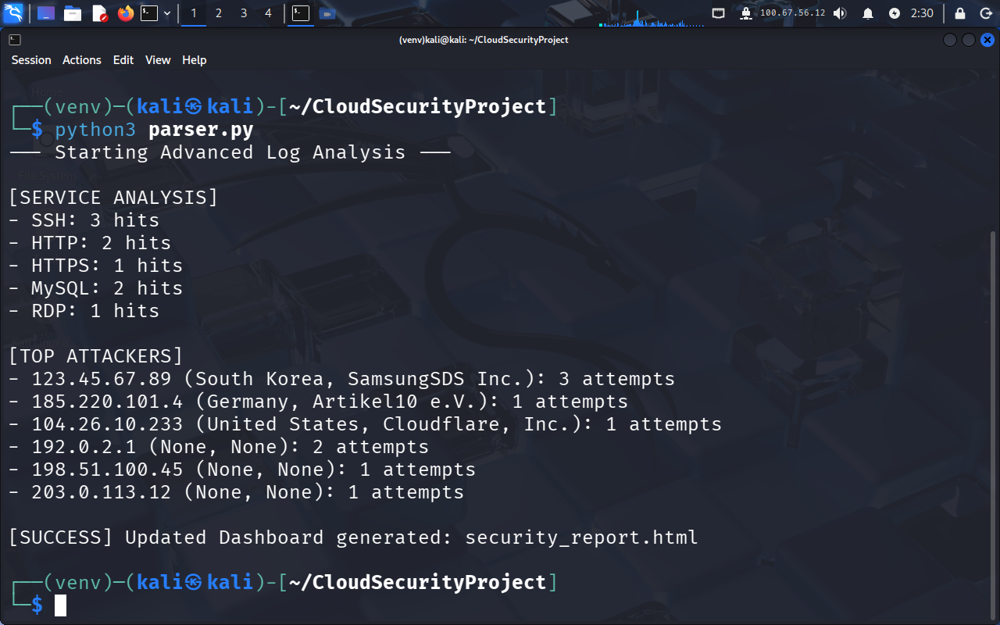
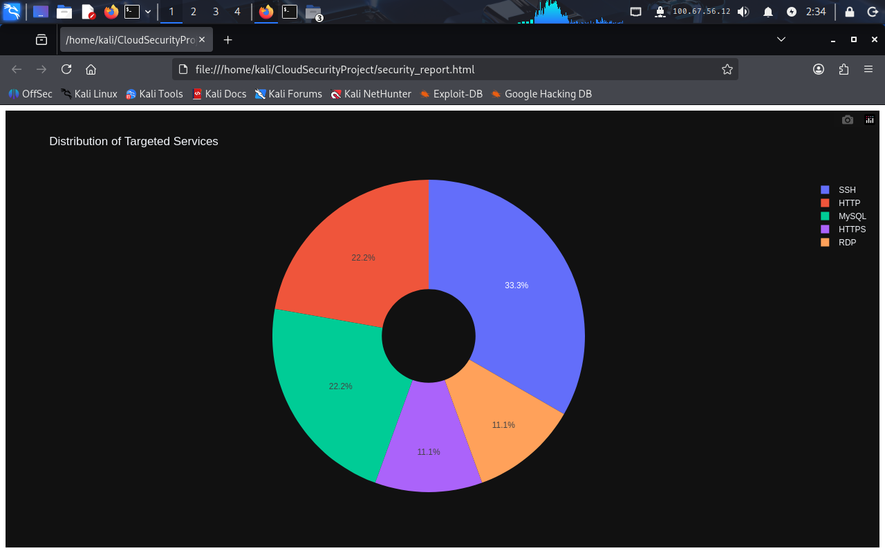

# Cloud-Native Firewall Log Analyzer & Threat Intelligence Pipeline

## 📖 Overview
This project is a Python-based security tool designed to automate the ingestion and analysis of raw firewall telemetry (UFW/iptables). It transforms messy log data into actionable intelligence by enriching IP addresses with geographic metadata and providing immediate remediation commands for Cloud (AWS) environments.

## ✨ Key Features
*   **Multi-Format Parsing:** Utilizes Regular Expressions (Regex) to extract Source IPs and Destination Ports from standard Linux firewall logs.
*   **Threat Intelligence Enrichment:** Integrates with the **IPGeolocation REST API** to identify attacker origins, countries, and ISPs.
*   **Service Profiling:** Maps port numbers to common protocols (SSH, RDP, MySQL, HTTP) to reveal targeted infrastructure.
*   **Automated Remediation:** Generates **AWS CLI** commands to dynamically update Network ACLs and block top offenders.
*   **Visual Analytics:** Produces interactive **Plotly** dashboards for executive-level reporting.

## 🛠️ Tech Stack
*   **Language:** Python 3.13
*   **Core Libraries:** `re` (Regex), `requests` (API), `plotly` (Visualization), `collections` (Data aggregation)
*   **Environment:** Kali Linux / VM Workstation Pro (Simulating a Cloud Instance)
*   **Cloud Focus:** AWS Network Security

---

## 📊 Results & Visualization

### 1. Terminal Security Report
This view shows the raw log data transformed into a structured security report with geographic context and cloud firewall commands.

### 2. Service Distribution Dashboard
The interactive Donut Chart provides a high-level overview of which services are under the most pressure from external scans.

---

## 🛡️ Incident Response Workflow
1. **Detect:** Script identifies a brute-force attempt on Port 22 (SSH).
2. **Analyze:** Geolocation identifies the source as an external, unauthorized hosting provider.
3. **Respond:** Script generates a `deny` rule for the AWS Network ACL to block the malicious IP at the cloud perimeter before it reaches the operating system.

---
**Note:** This project is for educational purposes and demonstrates the integration of Python scripting with cloud security operations.
